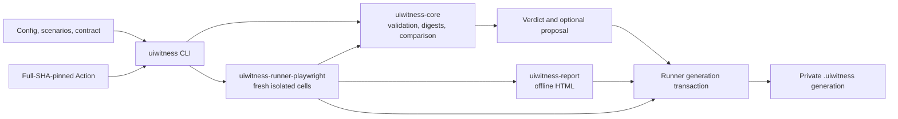
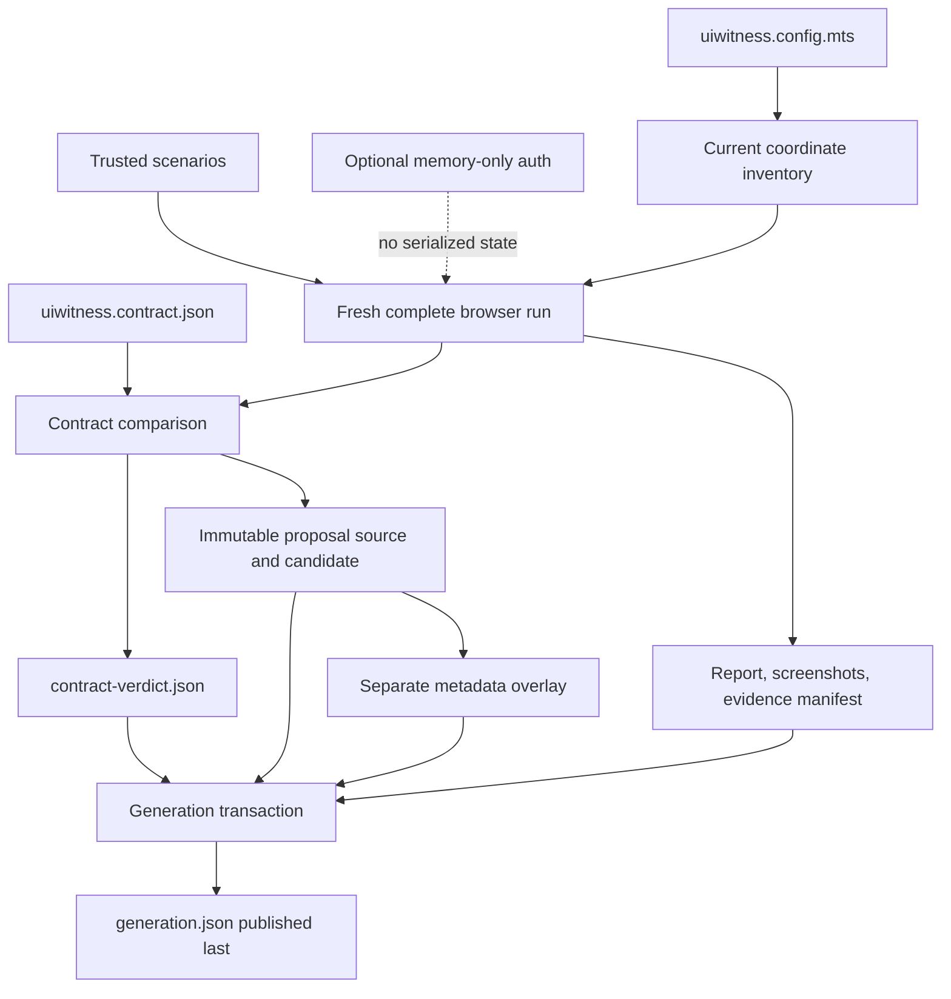
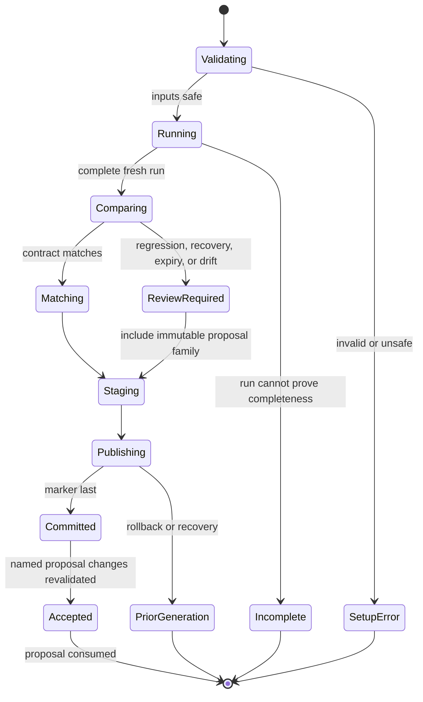
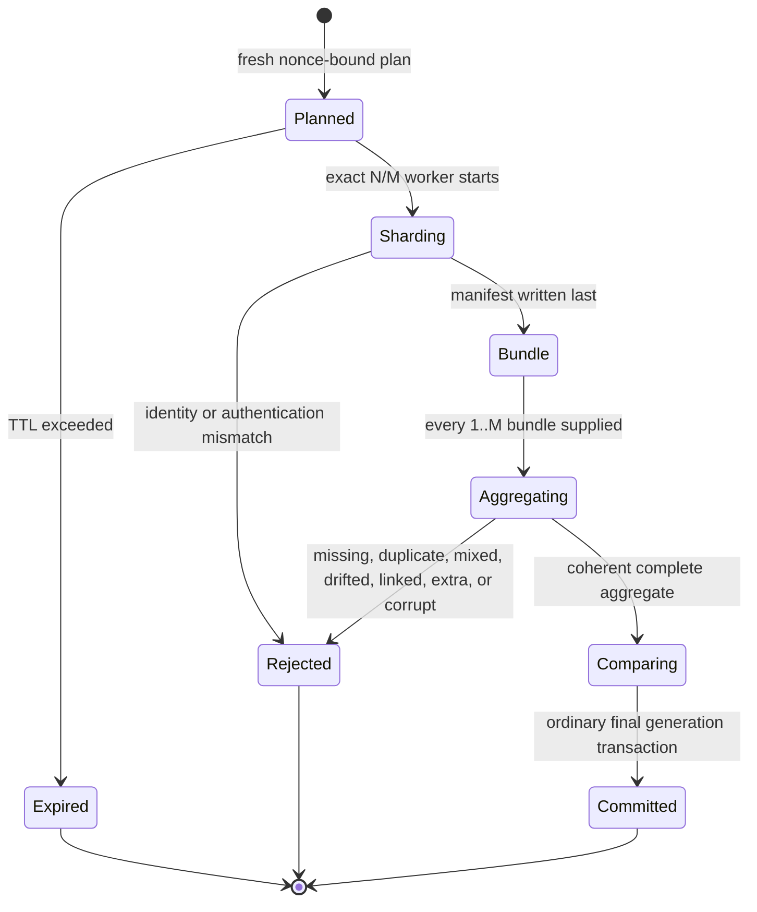
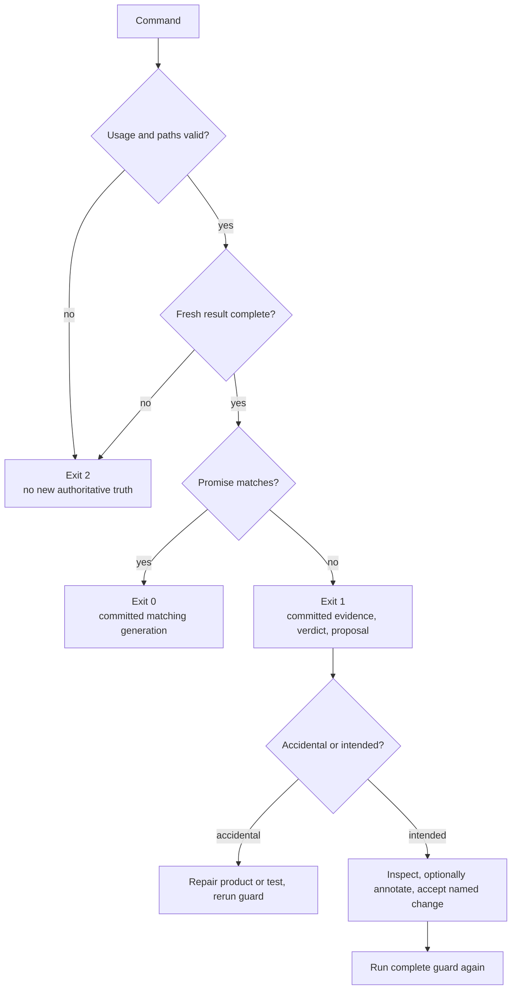
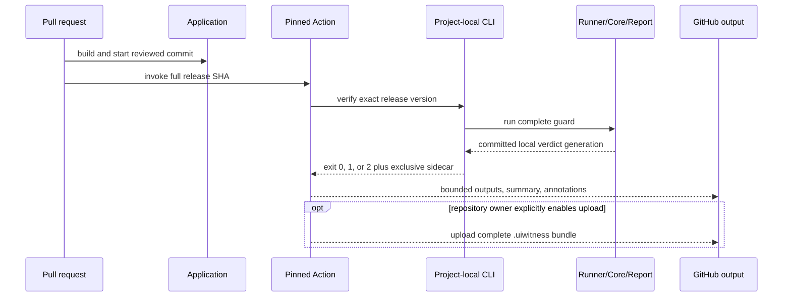
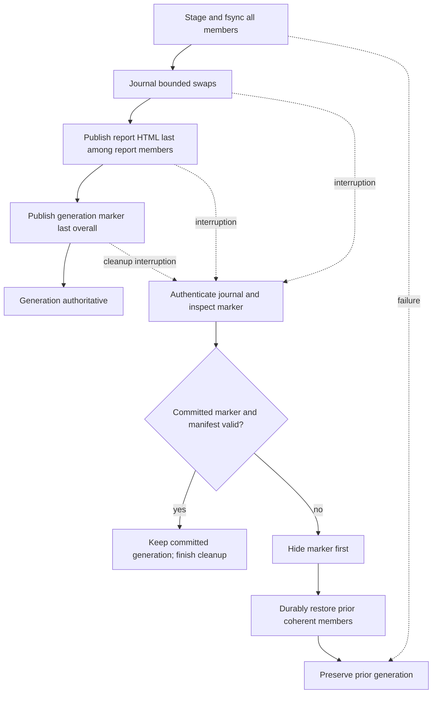
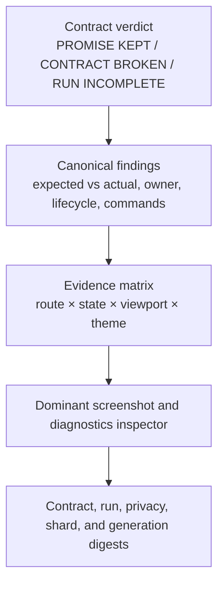

# State Contract Guard Architecture

This document is the technical map for the shipped State Contract Guard. The [operator guide](../open-source/STATE_CONTRACT_GUARD.md) owns task-oriented usage; this document owns package boundaries, state transitions, failure routing, and publication semantics.

## System architecture

The Action is a presentation adapter, not a fifth product implementation. It locates the adopting repository's locked CLI, proves version parity, and translates the process result into bounded GitHub output.

## Data and shadow paths

The contract is the only version-controlled product promise. Everything under `.uiwitness/` is private operational evidence or crash-recovery state.

Credentials, cookies, local storage, authorization headers, setup return values, raw request bodies, and unredacted diagnostics have no UIWitness-owned persistence path.

## Generation and proposal state machine

Guard and acceptance share the lock order: contract-writer lock, then runner generation lock. Acceptance regenerates the proposal from its source and revalidates the committed marker before changing the contract.

## Shard state machine

Partial bundles never update the latest report, verdict, proposal, or generation marker. The aggregator normalizes executions into current configuration order, so arrival order cannot affect final meaning.

## Error flow

Exit `2` is never equivalent to a product failure or success. It means the system could not prove the contract.

## CI deployment sequence

This is CI integration, not SaaS deployment. UIWitness itself has no hosted service or production data plane.

## Publication rollback flow

An operator rollback restores a reviewed contract or matching Action/package release through version control. It does not manually transplant generated evidence.

## Report information architecture

Ordinary `scan` and `check` omit the contract layer and keep the execution-first report. Guard adds contract truth above the same evidence matrix; it does not create a separate dashboard or hide complete no-script output.

## Package ownership

| Surface | Owner |
| --- | --- |
| Config, contract, proposal, shard schemas and canonical comparison | `uiwitness-core` |
| Browser lifecycle, capture, privacy enforcement, bundles, aggregation, atomic persistence | `uiwitness-runner-playwright` |
| Offline report transformation and rendering | `uiwitness-report` |
| Workspace policy, commands, fingerprints, orchestration, terminal behavior, acceptance | `uiwitness` |
| Hosted summary, annotations, version handshake, optional upload | root `action.yml` and composite scripts |

No browser behavior enters core comparison, no comparison policy enters the runner, no execution semantics enter the renderer, and no product implementation is duplicated in the Action.

## Bounds and invariants

- At most 10,000 configured coordinates.
- Shard plan TTL is 5–1440 minutes; default 60.
- Aggregate manifest reads stay within 16 MiB before report/evidence content.
- Declared aggregate report/evidence content is capped at 256 MiB before content reads.
- Every accepted bundle set is exactly one coherent `1..M` assignment union.
- New runner-owned files and directories are owner-private where supported.
- The committed marker is authoritative only when its content-addressed manifest and members validate.
- T14, not this architecture document, owns proof from packed packages, the released Action SHA, npm provenance, and a registry-only consumer.
